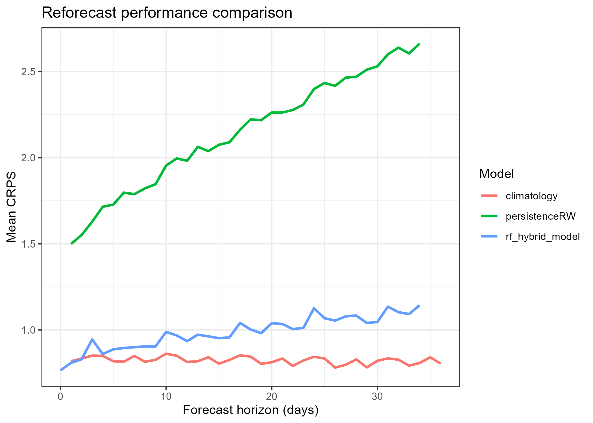
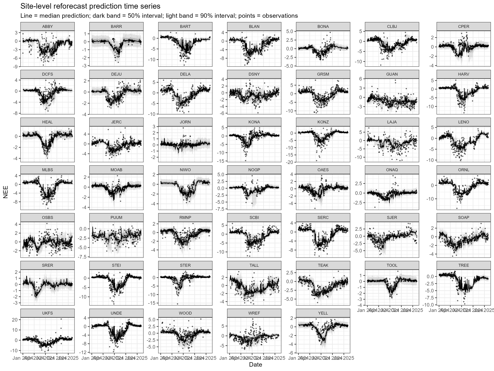
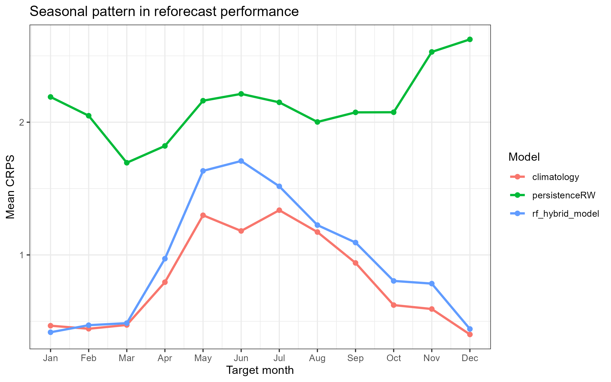
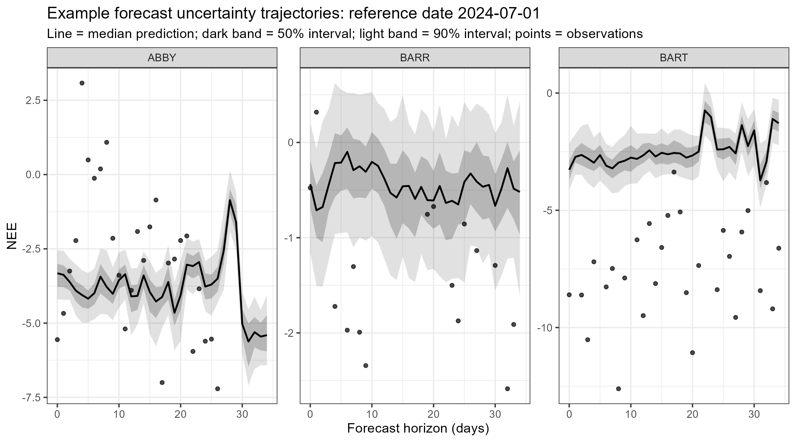

## 1. Model Description

The `rf_hybrid_model` forecasts daily Net Ecosystem Exchange (NEE) for the NEON Ecological Forecasting Challenge. The model is a hybrid machine-learning model based on a random forest algorithm. It uses meteorological forecast drivers, including air temperature, shortwave radiation, and vapor pressure deficit (VPD), together with lagged NEE and seasonal predictors. Day of year was transformed into sine and cosine terms to represent cyclic seasonality.

The model differs from simple baseline models by combining a machine-learning approach with environmental drivers and lagged ecosystem state. In addition, VPD is derived from temperature and relative humidity using a physically based formulation, introducing a process-informed component into the model.

Uncertainty is represented through three sources: NOAA ensemble weather drivers (driver uncertainty), bootstrap resampling of the training data (parameter uncertainty), and residual process noise added to ensemble predictions (process uncertainty).

## 2. Reforecast Analysis

The reforecast was conducted to mimic a real-time forecasting workflow. The model was trained using historical data from 2023, and evaluated over the period from January 1, 2024 to December 31, 2024. Forecasts were generated at a weekly interval, resulting in a series of rolling forecasts throughout the year.

For each reference date, only data available prior to that date were used for model training, and forecasts were generated for the subsequent 35 days using NOAA ensemble weather drivers. This design ensures that no future observations were used, avoiding data leakage and maintaining consistency with real-time forecasting conditions.

#### 2.1 Forecast performance across horizon

#### 2.2 Performance across sites

#### 2.3 Seasonal performance

#### 2.4 Forecast behavior

This is a case-study figure, not a global performance metric. It uses one representative reference date and several sites to show how uncertainty unfolds across the 35-day forecast horizon. 

## 3. Reproducibility

Model ID: `rf_hybrid_model` 
GitHub repository: [GitHub repository](https://github.com/Yikun-Z/neon4cast/tree/main/neon4cast) 
Reforecast generation code: [Reforecast code](https://github.com/Yikun-Z/neon4cast/blob/main/neon4cast/NEE_reforecast.R) 
Forecast generation code: [Forecast code](https://github.com/Yikun-Z/neon4cast/blob/main/neon4cast/NEE_forecast.R) 
Quarto report: [Quarto report](https://github.com/Yikun-Z/neon4cast/blob/main/neon4cast/rf_hybrid_model_report.qmd)
